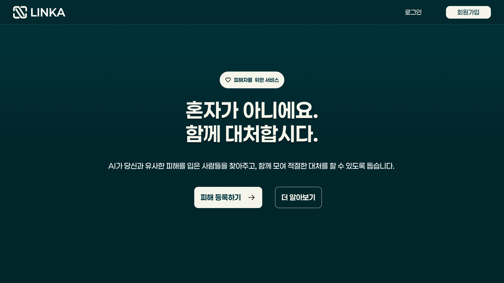
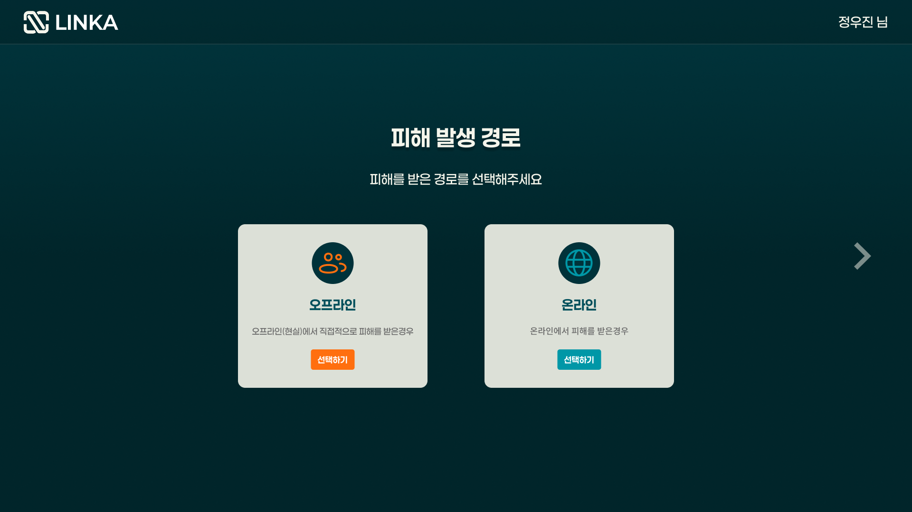
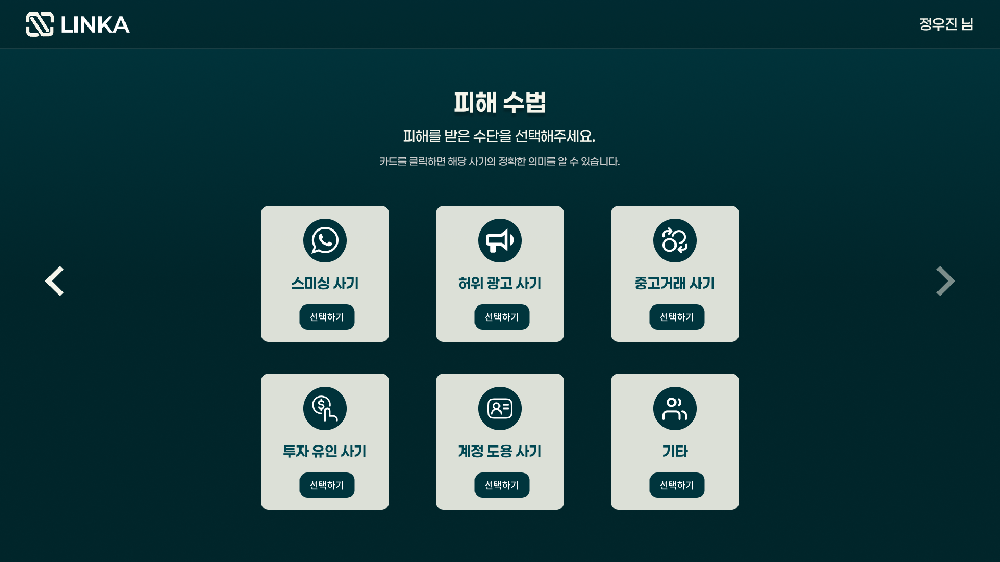
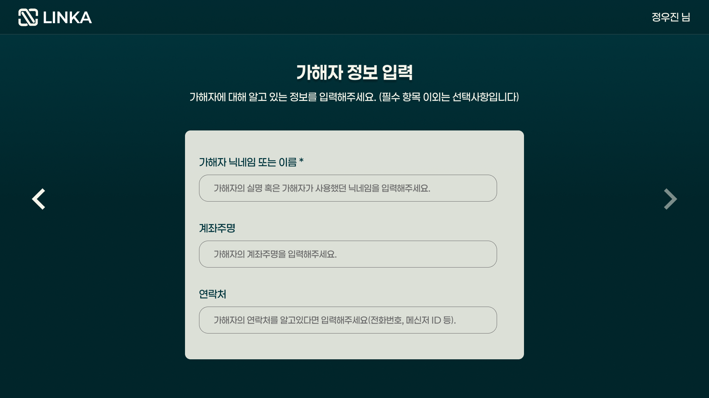
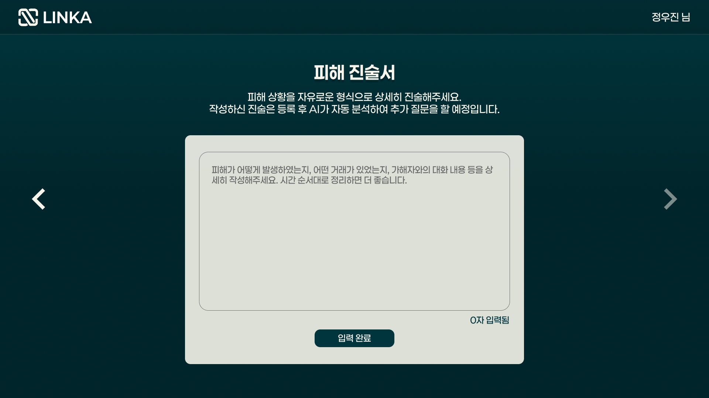
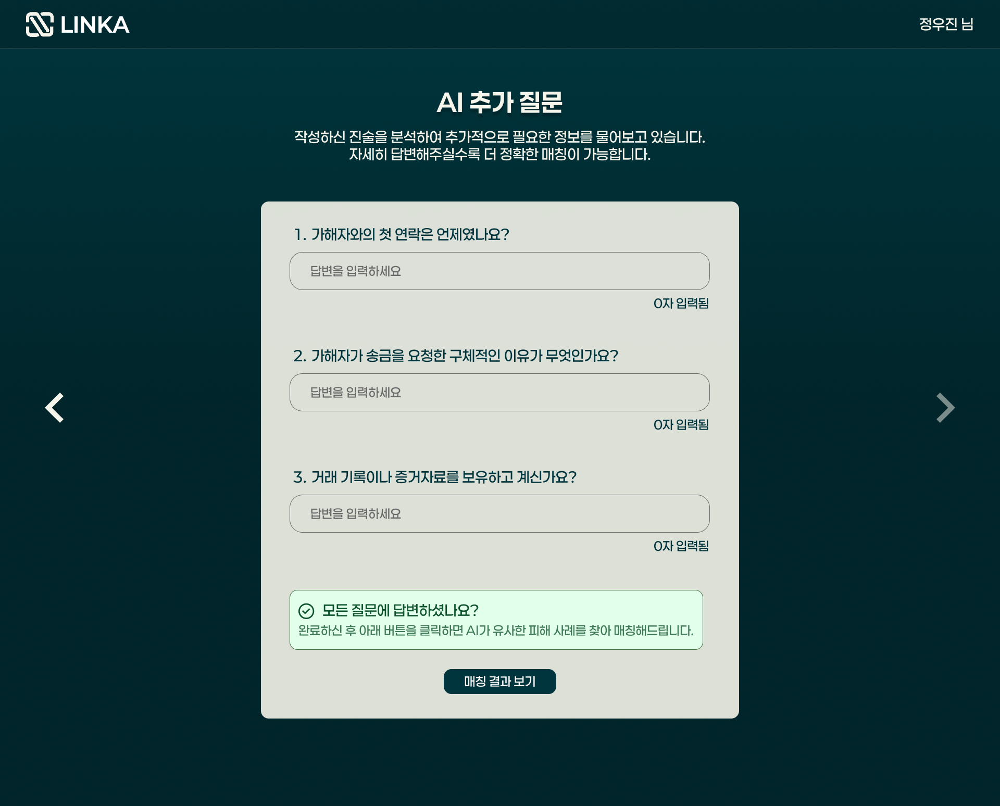
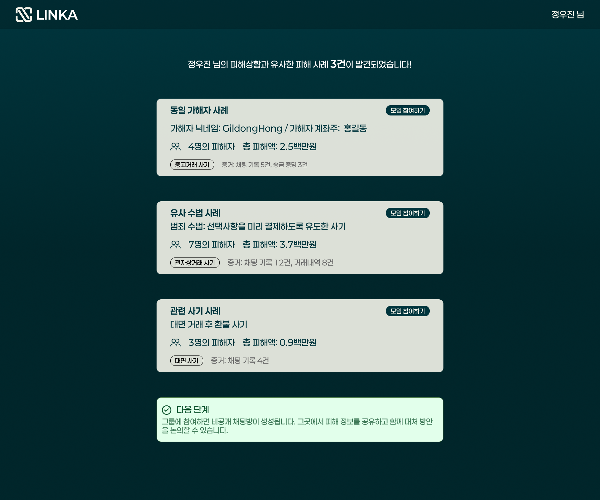
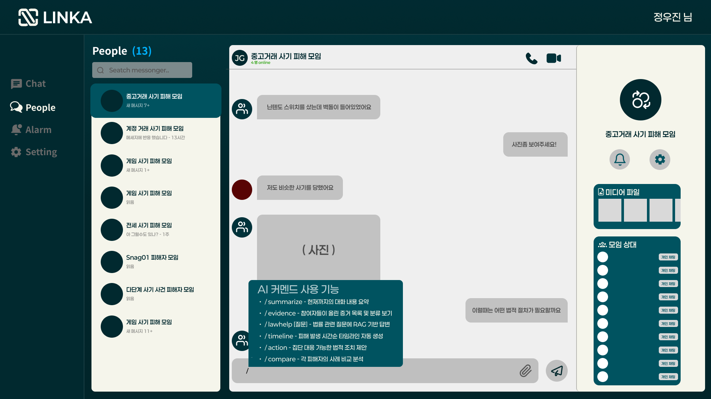

# 프로젝트명 : LINKA
> ### AI 기반 피해자 매칭 및 초기 법률 지원 플랫폼 - 동일 가해자 혹은 유사 수법으로 사기 피해를 당한 피해자들을 연결하여 공동 대응을 돕는 서비스

---

## 1. 핵심 아이디어
AI를 활용해 동일 가해자에게 피해를 입었거나 유사한 수법으로 사기를 당한 피해자들을 자동으로 매칭하고, 초기 법률 조언과 증거 보전 가이드를 제공하여 피해자들이 보다 효율적으로 공동 대응을 준비하도록 돕는 서비스이다.

---

## 2. 배경 및 목적
### 2.1. 문제점 발견
- 최근 전세사기, 중고거래 사기 등 크고 작은 다양한 유형의 사기가 빈번히 발생하며 사회적 문제로 대두되고 있음
- 많은 피해자들이 증거 부족 혹은 개인적 사정으로 적절한 대응을 하지 못하는 경우가 많음

### 2.2 서비스 목적
- 빠른 피해자 연결: 동일 가해자 또는 유사 수법 피해자들의 진술/증거를 AI로 분석하여 신속히 매칭함
- 증거 보전 및 수집 지원: AI가 부족한 정보를 보완 질문하고, 수집해야 할 증거 항목을 자동으로 제안함
- 초기 법률 조언 제공: 피해자의 상황에 맞는 신고처, 절차, 증거보존 방법을 안내
- 비용 및 시간 절감: 피해자들이 개별적으로 대응할 때 드는 비용과 시간을 집단적으로 줄임

---

## 3. 서비스의 기능

### 3.1. 피해자 등록
(1) 초기 정보 입력

  
<strong>해당 기능 UI/UX 이미지 보기</strong>

  
  
  
  

- 사용자가 구조화된 폼을 통해 기본 정보 입력함
  - 사기 유형 (중고거래, 전세, 투자, 대출, 기타 등)
  - 온/오프라인 여부
  - 플랫폼/사기를 당하게 된 경로 (중고거래 플랫폼 등)
  - 피해 발생 시점 및 기간
  - 금전적 피해 여부 및 규모
  - 가해자 식별 정보
    - 닉네임/이름
    - 연락처 (전화번호, 계정 ID 등)
    - 계좌 정보 (은행명, 계좌번호, 예금주명 등)
    - 가해자의 프로필 URL
    - 기타 식별 가능 정보

(2) 자유로운 형식으로 진술서 작성

  
<strong>해당 기능 UI/UX 이미지 보기</strong>

  
  

- 사용자가 피해 경위를 자유롭게 서술함
- 작성을 완료하면 AI가 진술을 분석하여 추가 질문을 생성함
  - 예시1: *가해자와의 첫 연락 날짜가 명확하지 않습니다. 대략적인 시점을 알려주시겠습니까?*
  - 예시2: *송금하게 된 구체적인 이유나 가해자의 설명이 있었나요?*
- 여기서 불명확하거나 누락된 부분을 보완함

(3) 데이터 구조화 및 저장
- AI가 진술서를 파싱하여 구조화된 JSON 형태로 변환
- 임베딩 벡터 생성 후 FAISS 벡터DB에 저장
- PostgreSQL에 메타데이터 및 원본 데이터 저장
- Cloudflare R2에 증거 파일 저장

### 3.2. AI 기반 피해자 매칭

  
<strong>해당 기능 UI/UX 이미지 보기</strong>

  
  

#### 매칭 알고리즘
(1) 1차 필터링: 가해자 식별 정보 기반 정확 매칭
- 계좌번호, 전화번호, 계정 ID 등 고유 식별자 일치 여부 확인

(2) 2차 검색: 하이브리드 검색 (BM25 + 벡터 유사도)
- BM25로 키워드 기반 유사 사례 검색
- FAISS로 진술 내용의 의미적 유사도 계산
- 두 점수를 가중 결합하여 최종 유사도 산출

(3) 3차 재랭킹: Cross-Encoder로 정밀 순위 조정
- 상위 후보들을 Cross-Encoder로 재평가
- 맥락을 고려한 정확한 유사도 계산

#### 매칭 결과 제시
- 유사도 점수와 함께 매칭된 사례 목록 표시
- 각 사례별 요약 정보 제공:
  - 가해자 정보 일치율
  - 사기 수법 유사도
  - 피해 시점 및 규모
  - 현재 대응 상황
- 사용자가 매칭 결과를 검토하고 그룹 참여 결정

### 3.3. 피해자 모임 (채팅방)
(1) 채팅룸 생성 및 관리
- 매칭 완료 시 자동으로 비공개 채팅룸 생성
- 초대 코드 기반 추가 멤버 초대 가능
- 채팅 내용은 암호화되어 저장

(2) AI 커맨드 시스템
채팅 내에서 슬래시 커맨드로 AI 기능 활용:
- `/summarize` - 현재까지의 대화 내용 요약
- `/evidence` - 참여자들이 올린 증거 목록 및 분류 보기
- `/timeline` - 피해 발생 시간순 타임라인 자동 생성
- `/lawhelp [질문]` - 법률 관련 질문에 RAG 기반 답변
- `/action` - 집단 대응 가능한 법적 조치 제안
- `/compare` - 각 피해자의 사례 비교 분석

(3) 자동 태그 생성
- AI가 대화 내용을 분석하여 자동 태그 생성
  - 예: #중고거래사기 #계좌이체사기 #허위매물 #전세사기
- 사용자가 수동으로 태그 추가/수정 가능
- 태그 기반 검색 및 필터링 지원

### 3.4. AI 법률 상담 및 조언
(1) RAG 기반 법률 상담 시스템
  1. 질의 분석: 사용자의 법률 질문을 분석하여 핵심 쟁점 파악
  2. 관련 법령/판례 검색: 벡터DB에서 관련성 높은 법령 및 판례 검색
  3. 컨텍스트 생성: 검색된 법률 정보를 컨텍스트로 구성
  4. 답변 생성: GPT-4가 RAG 컨텍스트를 기반으로 근거 있는 답변 생성
  5. 출처 제공: 답변의 근거가 된 법령 조항 및 판례 번호 명시

- 주의사항 표시
  - 모든 AI 법률 상담에는 "본 내용은 참고용이며, 정확한 법률 자문은 변호사와 상담하시기 바랍니다" 문구 표시
  - 복잡한 사안의 경우 전문 법률가 상담 권고

---

## 4. 활용 데이터 및 AI 모델
### 4.1 데이터 소스
- 법률 관련: 국가법령정보센터(법령·시행령·부칙 원문), 판례(대법원·하급심) 원문 및 메타데이터(법률명, 조문, 사건번호, 선고일 등)
- 사용자 제공 데이터: 피해 진술(자유문), 업로드된 증거(이미지, 문서, 채팅 로그), 가해자 식별 정보(선택적)
- 운영 데이터: 매칭 로그, 참여 동의 기록, 채팅 로그(동의 하에 암호화 저장)

### 4.2 AI 모델 구성(권장)
- 임베딩: e5-multilingual 또는 KoSimCSE (한국어 포함 다국어 지원)
- 검색/재랭킹: 초기 후보는 FAISS + BM25(텍스트 기반 보정), 재랭킹은 Cross-Encoder (Multilingual MiniLM 계열)
- 생성/상담: ChatGPT API (GPT-4 계열) — RAG(검색결과 + 법령/판례 근거 포함)로 응답 생성
- 추가: 증거 이미지 OCR, 대화 로그 익명화·요약 모델

---

## 5. 기술 스택
### 5.1. 프론트엔드
- 프레임워크: Next.js 
- 스타일링: Tailwind CSS
- 상태 관리: Zustand 또는 React Context API
- 실시간 통신: WebSocket (채팅 기능)

### 5.2. 백엔드
- API 서버: FastAPI (Python)
- 데이터베이스: PostgreSQL (메타데이터 및 구조화 데이터)
- 파일 스토리지: Cloudflare R2 (증거 파일)
- 벡터 검색: FAISS (로컬) 또는 Pinecone (클라우드 옵션)
- 인증: JWT 기반 인증

### 5.3. AI/ML
- 임베딩: e5-multilingual-large 또는 KoSimCSE-roberta
- 재랭킹: Cross-Encoder (ms-marco-MiniLM 계열)
- 생성 모델: OpenAI GPT-4 API
- 키워드 검색: BM25 (Elasticsearch로 구현)
- OCR: Google Cloud Vision API 또는 Tesseract

### 5.4. 인프라
- 배포: Vercel (프론트), AWS EC2 또는 Fly.io (백엔드)
- CI/CD: GitHub Actions
- 모니터링: Sentry (에러 추적), Datadog (성능 모니터링)

---

## 6. 서비스 아이디어의 창의성 및 구현 가능성
### 6.1. 창의성
(1) 차별화된 접근
- 피해자 중심 설계
  - 기존 신고 시스템은 가해자 처벌 중심이지만, LINKA는 피해자 간 연결과 집단 대응에 초점
  - 소액 피해자도 힘을 합쳐 효과적으로 대응할 수 있는 환경 제공
- AI 기반 자동 매칭의 혁신성
  - 단순 키워드 검색이 아닌 의미적 유사도 기반 매칭으로 더 정확한 연결
  - 동일 가해자뿐만 아니라 유사한 수법의 사기까지 탐지 가능
  - 피해자가 직접 찾아다니지 않아도 자동으로 연결되는 편의성
- RAG 기반 법률 상담의 실용성
  - 변호사 상담 전 초기 대응 방향을 스스로 파악 가능
  - 법률 지식이 없는 일반인도 쉽게 이해할 수 있는 설명 제공
  - 근거 법령 및 판례를 명시하여 신뢰성 확보
- 데이터 기반 사기 예방 가능성
  - 누적된 사기 패턴 데이터를 분석하여 신종 사기 유형 조기 발견
  - 향후 사기 예방 교육 및 경보 시스템으로 확장 가능
  
(2) 사회적 가치
- 집단 지성 활용: 흩어져 있던 피해자들을 연결하여 집단의 힘으로 대응
- 정보 비대칭 해소: 법률 정보 접근성이 낮은 사람들에게 초기 가이드 제공
- 2차 피해 예방: 신속한 정보 공유로 추가 피해자 발생 방지

### 6.2. 구현 가능성
(1) 기술적 실현 가능성
- Next.js, FastAPI 모두 성숙한 프레임워크로 빠른 개발 가능
- FAISS, GPT-4 API 등 검증된 오픈소스 및 상용 도구 활용
- 해커톤 기간 내 MVP 구현 충분히 가능

(2) 데이터 확보 가능성
- 국가법령정보센터 API는 공개되어 있어 법령 데이터 크롤링 가능
- 대법원 판례는 공개 데이터로 수집 가능
---

## 7. 기대 효과
### 7.1. 피해자 측면
- 동일 가해자/유사 사기 피해자를 빠르게 찾아 집단 대응 가능
- 법률 지식이 없어도 초기 대응 방향 파악 가능
- 집단 소송으로 비용 및 시간 절감

### 7.2. 사회적 측면
- 사기 가해자의 반복 범행 억제 효과
- 사기 패턴 데이터 축적으로 신종 사기 예방 기여
- 법률 서비스 접근성 향상으로 정의 실현 기회 확대

### 7.3. 비즈니스 측면
- 변호사/법무법인과의 파트너십 기회
- 보험사, 금융기관과의 협력 모델 구축 가능
- 사기 예방 교육 콘텐츠 사업 확장 가능
